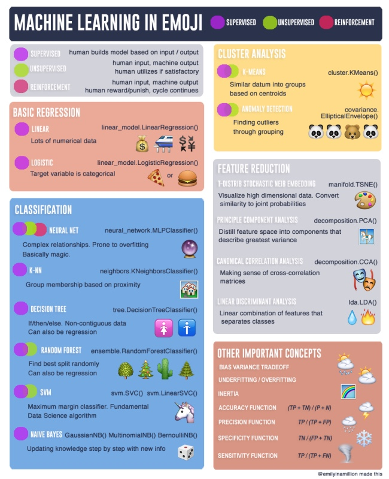

# Learning
Implementing algorithms from scratch so I can learn more about machine learning, statistics and computer science.

## Notebooks

### Machine Learning
- [Machine Learning Recipes](notebooks/ml_recipes.ipynb)
    - Splitting Training and Testing Data
    - Decision Trees
    - Visualising Tree Decisions
    - K-Nearest Neighbours (implemented from scratch)
- [Programmers Guide to Data Mining](notebooks/programmers_guide.ipynb)
    - Distance Metrics
    - Pearson Correlation
- [Unsupervised Machine Learning](notebooks/unsupervised_ml.ipynb)
    - K-means clustering
    - Hierarchical Clustering
- [Practical Machine Learning](notebooks/practical_ml.ipynb)
    - Implementing machine learning algorithms from scratch using stock market data

### Natural Language Processing
- [Machine Learning with Text](notebooks/ml_text.ipynb)
    - Notes from PyCon workshop on NLTK
    - Uses scikit-learn analyse text, covers bag of words
- [Natural Language](notebooks/natural_language.ipynb)
    - Notes from NLTK tutorial series

### Statistics
- [Bayes Made Simple](notebooks/bayes_simple.ipynb)
    - Notes from PyCon workshop on Bayesian statistics and a few other articles I've read on the topic
- [Monte Carlo Introduction](notebooks/monte_carlo_intro.ipynb)
    - 

# Concepts

Things I'm interested in at the moment

## Supervised
This algorithm consist of a target / outcome variable (or dependent variable) which is to be predicted from a given set of predictors (independent variables).
- Regression
- Decision Trees/Random Forest
- KNN
- Logistic Regression
- Naive Bayes
- Gradient Boost & Adaboost

## Unsupervised
 In this algorithm, we do not have any target or outcome variable to predict / estimate.  It is used for clustering population in different groups, which is widely used for segmenting customers in different groups for specific intervention.
- Apriori algorithm
- K Means
- PCA/LDA

## Reinforcement
Using this algorithm, the machine is trained to make specific decisions. It works this way: the machine is exposed to an environment where it trains itself continually using trial and error.
- Markov Decision Process

## Basic Visualization
- Histogram
- Bar / Line Chart
- Box plot
- Scatter plot

## Advanced Visualization
- Heat Map
- Mosaic Map
- Map Visualization
- 3D Graphs
- Correlogram

# Data Scientist Requirements

## Statistics/ML
- Bayes/Probability
- Correlation/Regression/Logistic Regression
	- ridge regression and LASSO
- Explain the following parts of a linear regression to me: p-value, coefficient, R-Squared value. What is the significance of each of these components and what assumptions do we hold when creating a linear regression?
- Assume you need to generate a predictive model of a quantitative outcome variable using multiple regression. Explain how you intend to validate this model.
- Explain what precision and recall are. How do they relate to the ROC curve?
- Explain what a long tailed distribution is and provide three examples of relevant phenomena that have long tails. Why are they important in classification and prediction problems?
- Random Forest
- Data:
	- Difference between qualitative and quantitative data
	- How would you analyse both?
	- What is the Central Limit Theorem and why is it important in data science?
	- How do you handle missing data?
	- Explain the 80/20 rule, and tell me about it's importance in model validation.
	- In your opinion, which is more important when designing a machine learning model: Model performance? or model accuracy?
	- What is one way that you would handle an imbalanced data set that's being used for prediction? (i.e. vastly more negative classes than positive classes.)
- Explain like I'm 5: K-Means clustering algorithm.
- Explain what a local optimum is and why it is important in a specific context, such as k-means clustering. What are specific ways for determining if you have a local optimum problem? What can be done to avoid local optima?
- I have two models of comparable accuracy and computational performance. Which one should I choose for production and why? Verify that comparable accuracy means comparable precision/recall/etc. Then go for the more interpretable one, or for the more established algorithm. I.E. if logistic regression does as well as an SVM with a custom kernel, go for logistic regression.
Depending on the model, try to look into the logic using something line LIME and choose the one that's consistent with your intuition.
Look at where each model is wrong and see if the cost of the error is the same. Example: both models are wrong 10% of the time, but one is wrong about customers worth 100k and the other is wrong about customers worth 10k, choose the second.

# Problem Solving
- Estimate the number of 'Happy Birthday' posts that are logged on Facebook everyday.
- You have a data set containing 100K rows, and 100 columns, with one of those columns being our dependent variable for a problem we'd like to solve. How can we quickly identify which columns will be helpful in predicting the dependent variable. Identify two techniques and explain them to me as though I were 5 years old.
- Given tweets and Facebook statuses surrounding a new movie that was recently released, how will you determine the public's reaction to the movie?
- 

## Programming
- SQL:
	- Difference between an inner join, left join/right join, and union
	- Apply these techniques to a theoretical data analysis question

## Visualisation
- What are your 3 favourite data visualization techniques?

## Business
- How the business works
- How it collects its data
- How it intends to use this data
- What it hopes to achieve from these analyses.

